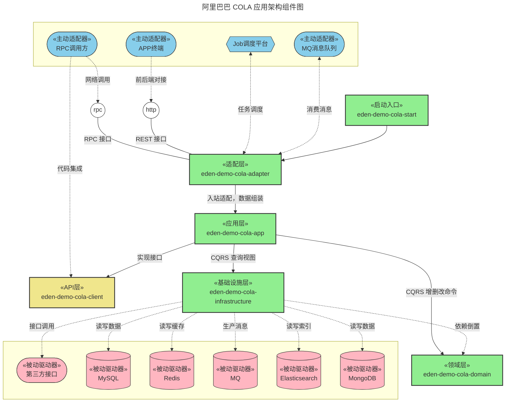
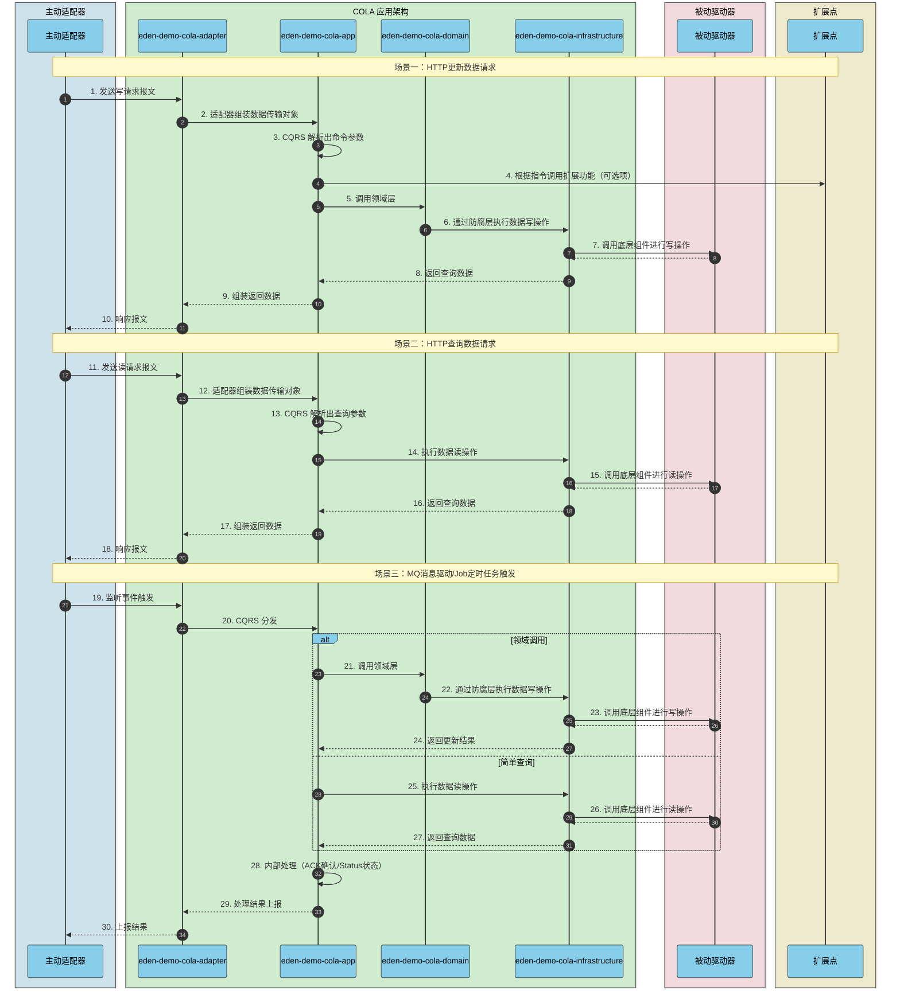
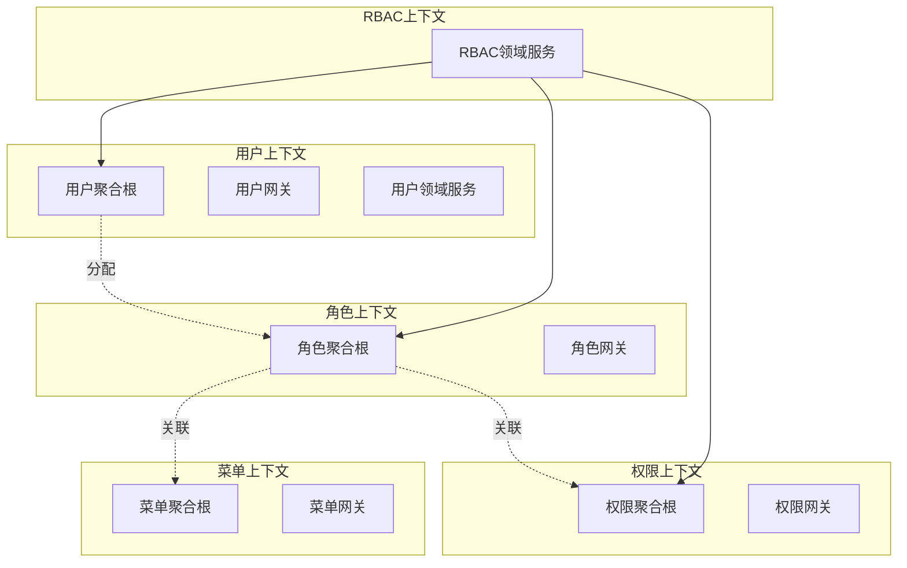
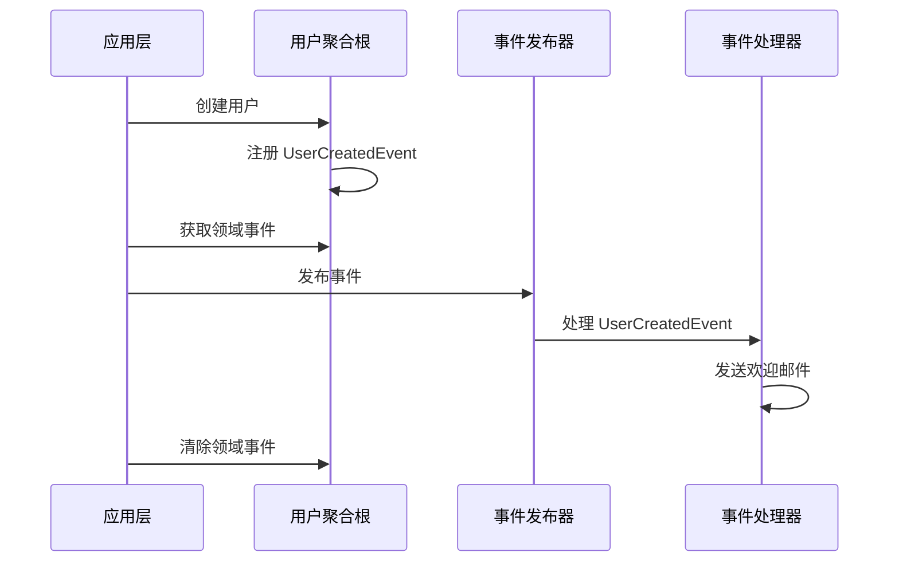
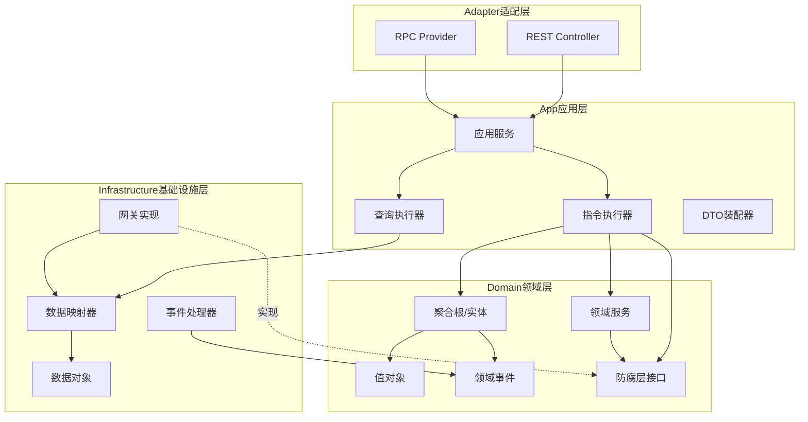
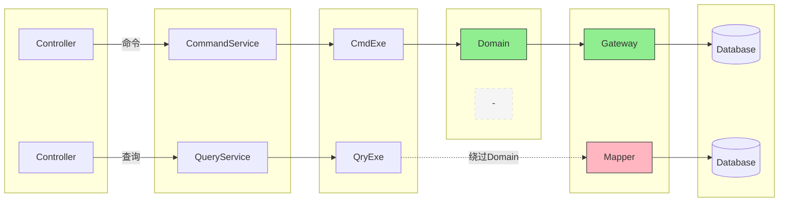

# COLA 架构

[](https://github.com/shiyindaxiaojie/eden-demo-cola)
[](https://github.com/shiyindaxiaojie/eden-demo-cola/actions)
[](https://www.apache.org/licenses/LICENSE-2.0.html)
[](https://sonarcloud.io/dashboard?id=shiyindaxiaojie_eden-demo-cola)

<p>
  <strong>整洁的、面向对象的、分层的、可扩展的应用架构</strong>
</p>

简体中文 | [English](./README.md)

---

本项目使用 COLA 架构构建，COLA 架构是一个整洁的，面向对象的，分层的，可扩展的应用架构，可以帮助降低复杂应用场景的系统熵值，提升系统开发和运维效率。不管是传统的分层架构、六边形架构、还是洋葱架构，都提倡以业务为核心，解耦外部依赖，分离业务复杂度和技术复杂度等，COLA 架构在此基础上融合了 CQRS、DDD、SOLID 等设计思想，形成一套可落地的应用架构。具体可以查阅 [WIKI](https://github.com/shiyindaxiaojie/eden-demo-cola/wiki/Home-zh-CN) 。

## 文档指南

📚 详细的组件集成指南，请参阅文档：

- [中文文档](./docs/zh-CN/README.md) - 中文组件集成指南
- [English Documentation](./docs/en/README.md) - Component integration guides in English

## 组件构成



* **eden-demo-cola-adapter**：适配层，**六边形架构**中的入站适配器。
* **eden-demo-cola-app**：应用层，负责 **CQRS** 的指令处理工作，更新指令，调用领域层，查询视图操作，直接绕过领域层调用基础设施层。
* **eden-demo-cola-client**：API层，对外以 jar 包的形式提供接口。
* **eden-demo-cola-domain**：领域层，业务核心实现，不同于传统的分层架构，提供防腐层接口，不依赖基础设施层的技术实现。
* **eden-demo-cola-infrastructure**：基础设施层，**六边形架构**中的出站适配器，封装技术细节，使用**依赖倒置**实现 Domain 暴露的防腐层接口。
* **eden-demo-cola-start**：程序启动入口，统一管理应用的配置和交付。

## 运行流程



## 如何构建

由于 `Spring Boot 2.4.x` 和 `Spring Boot 3.0.x` 在架构层面有很大的变更，因此笔者采取跟 Spring Boot 版本号一致的分支:

* 2.4.x 分支适用于 `Spring Boot 2.4.x`，最低支持 JDK 1.8。
* 2.7.x 分支适用于 `Spring Boot 2.7.x`，最低支持 JDK 11。
* 3.0.x 分支适用于 `Spring Boot 3.0.x`，最低支持 JDK 17。

本项目默认使用 Maven 来构建，最快的使用方式是 `git clone` 到本地。为了简化不必要的技术细节，本项目依赖 [eden-architect](https://github.com/shiyindaxiaojie/eden-architect)，在项目的根目录执行 `mvn install -T 4C` 完成本项目的构建。

## 如何启动

### 快速体验

本项目默认设置了 dev 运行环境，为了方便您直接启动项目，所有外部的组件依赖均为关闭状态。

1. 在项目目录下运行 `mvn install`（如果不想运行测试，可以加上 `-DskipTests` 参数）。
2. 进入 `eden-demo-cola-start` 目录，执行 `mvn spring-boot:run` 或者启动 `ColaApplication` 类。运行成功的话，可以看到 `Spring Boot` 启动成功的界面。
3. 本应用中已经实现了一个简单的 `RestController` 接口，可以点击 [演示接口](http://localhost:8081/api/users/1) 进行调试。
4. 由于目前的主流是前后端分离开发，请按需实现页面。访问 [http://localhost:8081](http://localhost:8081) 将跳转到 404 页面。


### 微调配置

**开启注册中心和配置管理**：推荐使用 `Nacos` 组件，您可以查阅 [Nacos Quick Start](https://nacos.io/zh-cn/docs/quick-start.html) 快速搭建，请根据您的 Nacos 地址修改配置文件：[bootstrap-dev.yml](https://github.com/shiyindaxiaojie/eden-demo-cola/blob/main/eden-demo-cola-start/src/main/resources/config/bootstrap-dev.yml)，调整以下内容：

```yaml
spring:
  cloud:
    nacos:
      discovery: # 注册中心
        enabled: true # 默认关闭，请按需开启
      config: # 配置中心
        enabled: true # 默认关闭，请按需开启
```

**修改默认的数据源**：本项目默认使用 `H2` 内存数据库启动，基于 `Liquibase` 在项目启动时自动初始化 SQL 脚本。如果您使用的是外部的 MySQL 数据库，可以从此处调整下数据库的连接信息：[application-dev.yml](https://github.com/shiyindaxiaojie/eden-demo-cola/blob/main/eden-demo-cola-start/src/main/resources/config/application-dev.yml)，请删除任何与 `H2` 有关的配置。

```yaml
spring:
#  h2: # 内存数据库
#    console:
#      enabled: true # 线上环境请勿设置
#      path: /h2-console
#      settings:
#        trace: false
#        web-allow-others: false
  datasource: # 数据源管理
    username: 
    password: 
    url: jdbc:mysql://host:port/schema?rewriteBatchedStatements=true&useSSL=false&useOldAliasMetadataBehavior=true&useUnicode=true&serverTimezone=GMT%2B8
    driver-class-name: com.mysql.cj.jdbc.Driver
```

此外，本项目还罗列了 `Redis` 缓存、`RocketMQ` 消息队列、`ShardingSphere` 分库分表等常用组件的使用方案，默认通过 `xxx.enabled` 关闭自动配置。您可以根据实际情况开启配置，直接完成组件的集成。

## 如何部署

### FatJar 简易部署

执行 `mvn -T 4C clean package` 打包成一个可运行的 fat jar，参考如下命令启动编译后的控制台。

```bash
java -Dserver.port=8081 -jar target/eden-demo-cola-start.jar
```

### Assembly 打包部署

执行 `mvn -P assembly -T 4C clean package` 打包成压缩包，选择下列压缩包复制一份到您期望部署的目录。

* target/eden-demo-cola-start-assembly.zip
* target/eden-demo-cola-start-assembly.tar.gz

解压文件后，您可以在 `bin` 目录下找到 `startup.sh` 或者 `startup.bat`脚本，直接运行即可。

### Jib 镜像部署

Google Jib 插件允许您在没有安装 Docker 下完成镜像的构建。

```bash
mvn -T 4C -U package
mvn -pl eden-demo-cola-start jib:build -Djib.disableUpdateChecks=true -DskipTests
```

### Docker 容器部署

基于 Spring Boot 的分层特性构建镜像，请确保正确安装了 Docker 工具，然后执行以下命令。

```bash
docker build -f docker/Dockerfile -t eden-demo-cola:{tag} .
```

### Helm 应用部署

以应用为中心，建议使用 Helm 统一管理所需部署的 K8s 资源描述文件，请参考以下命令完成应用的安装和卸载。

```bash
helm install eden-demo-cola ./helm # 部署资源
helm uninstall eden-demo-cola # 卸载资源
```

## 持续集成

> CI/CD 工具选型：Jenkins、CODING、Codeup、Zadig、KubeVela

### Jenkins 持续集成

下图演示基于 Jenkins 实现持续构建、持续部署的效果。


### CODING 持续集成

下图演示基于 CODING 实现持续构建、持续部署的效果。[传送锚点](https://mengxiangge.netlify.app/2022/08/10/devops/coding%20%E6%8C%81%E7%BB%AD%E9%83%A8%E7%BD%B2%E5%AE%9E%E8%B7%B5/?highlight=coding)


## 最佳实践

### DDD 领域驱动设计

本项目以 RBAC（基于角色的访问控制）为例，展示如何在 COLA 架构中落地 DDD 领域驱动设计。

**战略设计 - 限界上下文划分**

将 RBAC 系统划分为用户、角色、权限、菜单四个限界上下文，每个上下文包含聚合根、网关接口和领域服务。RBAC 上下文作为协调者，负责跨上下文的业务编排。



**战术设计 - 领域模型**

领域模型采用充血模型设计，聚合根（User、Role、Permission、Menu）封装业务行为，值对象（Login、Email、Password 等）保证数据完整性和不可变性。


**战术设计 - 领域事件**

领域事件用于解耦聚合间的依赖关系。聚合根在执行业务操作时注册事件，应用层负责发布事件，事件处理器异步执行后续操作（如发送邮件通知）。



**分层架构 - COLA 分层与 DDD 映射**

COLA 四层架构与 DDD 战术模式的对应关系：适配层处理入站请求，应用层编排用例，领域层实现核心业务逻辑，基础设施层提供技术实现。Gateway 接口定义在领域层，实现在基础设施层，体现依赖倒置原则。



**分层架构 - CQRS 命令查询分离**

命令流程（增删改）经过 Domain 层处理业务逻辑，查询流程直接访问 Infrastructure 层的 Mapper，绕过 Domain 层以提升查询性能。



| 类型 | 路径 | 特点 |
|------|------|------|
| 命令（写） | Controller → Service → CmdExe → Domain → Gateway → DB | 经过领域层，保证业务规则 |
| 查询（读） | Controller → Service → QryExe → Mapper → DB | 绕过领域层，提升性能 |

**代码结构**

按限界上下文组织代码目录，每个上下文包含 entity（聚合根/实体）、valueobject（值对象）、event（领域事件）、domainservice（领域服务）、gateway（防腐层接口）等子目录。

```
eden-demo-cola-domain/
├── user/                          # 用户限界上下文
│   ├── entity/                    # 实体
│   │   ├── User.java              # 用户聚合根
│   │   └── UserStatus.java        # 用户状态枚举
│   ├── valueobject/               # 值对象
│   │   ├── Login.java             # 登录账号
│   │   ├── Email.java             # 邮箱
│   │   └── Password.java          # 密码
│   ├── event/                     # 领域事件
│   │   ├── UserCreatedEvent.java  # 用户创建事件
│   │   └── UserEmailChangedEvent.java
│   ├── domainservice/             # 领域服务
│   │   └── UserDomainService.java
│   ├── gateway/                   # 防腐层接口
│   │   └── UserGateway.java
│   └── statemachine/              # 状态机
│       └── UserStateMachine.java
├── role/                          # 角色限界上下文
│   ├── entity/
│   │   ├── Role.java              # 角色聚合根
│   │   └── RoleStatus.java
│   ├── valueobject/
│   │   ├── RoleCode.java
│   │   └── RoleName.java
│   └── gateway/
│       └── RoleGateway.java
├── permission/                    # 权限限界上下文
│   ├── entity/
│   │   ├── Permission.java        # 权限聚合根
│   │   └── PermissionType.java
│   ├── valueobject/
│   │   └── PermissionCode.java
│   └── gateway/
│       └── PermissionGateway.java
├── menu/                          # 菜单限界上下文
│   ├── entity/
│   │   ├── Menu.java              # 菜单聚合根
│   │   └── MenuStatus.java
│   ├── valueobject/
│   │   └── MenuPath.java
│   └── gateway/
│       └── MenuGateway.java
└── rbac/                          # RBAC 跨上下文协调
    └── domainservice/
        └── RbacDomainService.java
```

**设计原则**

| 原则 | 说明 | 示例 |
|------|------|------|
| 聚合根 | 作为聚合的入口，保证聚合内的一致性 | User、Role、Permission、Menu |
| 值对象 | 无唯一标识，通过属性值判断相等性 | Login、Email、Password、RoleCode |
| 领域事件 | 记录领域中发生的重要事件 | UserCreatedEvent、UserEmailChangedEvent |
| 领域服务 | 处理跨聚合的业务逻辑 | UserDomainService、RbacDomainService |
| 防腐层 | 隔离领域层与基础设施层 | UserGateway、RoleGateway |
| 依赖倒置 | 领域层定义接口，基础设施层实现 | Gateway 接口与 GatewayImpl 实现 |

### Git 多人协作分支管理

在敏捷开发盛行的时代，`GitFlow` 显得力不从心，笔者为团队制定了一套简单易用的流程。[传送锚点](https://www.processon.com/view/63d5d1fc56e18032d4a00998)


详细的分支管理策略、Maven 版本管理、敏捷迭代周期等内容，请参阅 [Git 工作流](https://github.com/shiyindaxiaojie/eden-demo-cola/wiki/Git-Workflow)。

### CAT 可观测性方案

通过 `TraceId` 分析整个链路的 `HTTP` 请求耗时、`RPC` 调用情况、`Log` 业务日志、`SQL` 和 `Cache` 执行耗时。[传送锚点](https://github.com/shiyindaxiaojie/cat)


### Sentinel 流量治理方案

根据业务负载配置您的流控规则，并允许在任意时刻查看接口的 QPS 和限流情况。[传送锚点](https://github.com/shiyindaxiaojie/Sentinel)


### Arthas 在线诊断工具

使用动态时运行探针，自动发现服务，开箱即用，允许在低负载环境诊断你的应用。[传送锚点](https://github.com/shiyindaxiaojie/arthas)


## 版本规范

项目的版本号格式为 `x.y.z` 的形式，其中 x 的数值类型为数字，从 0 开始取值，且不限于 0~9 这个范围。项目处于孵化器阶段时，第一位版本号固定使用 0，即版本号为 `0.x.x` 的格式。

* 孵化版本：0.0.1-SNAPSHOT
* 开发版本：1.0.0-SNAPSHOT
* 发布版本：1.0.0

版本迭代规则：

* 1.0.0 <> 1.0.1：兼容
* 1.0.0 <> 1.1.0：基本兼容
* 1.0.0 <> 2.0.0：不兼容

## 变更日志

请查阅 [CHANGELOG.md](https://github.com/shiyindaxiaojie/eden-demo-cola/blob/main/CHANGELOG.md)
