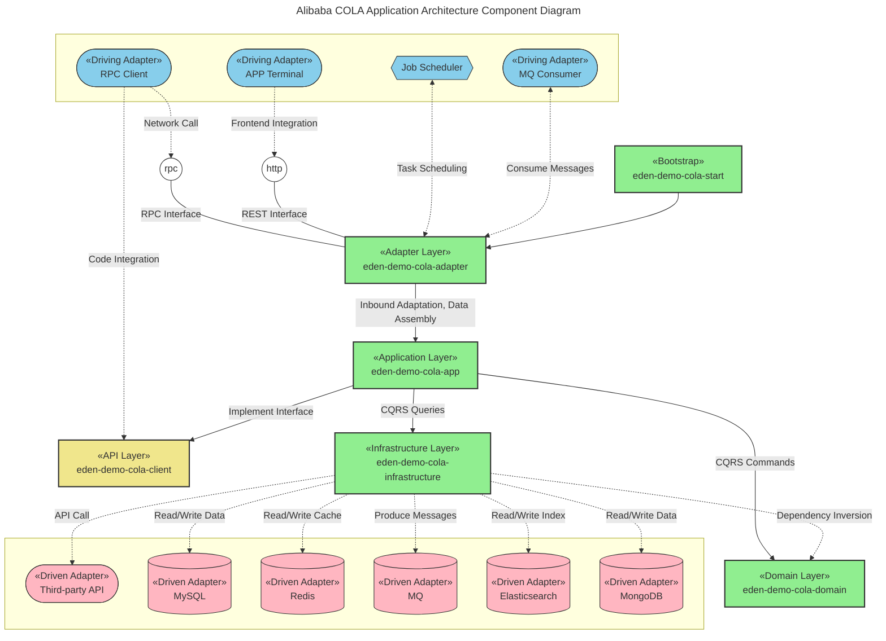
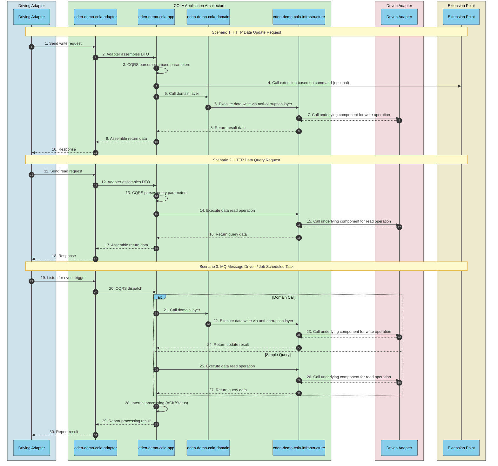
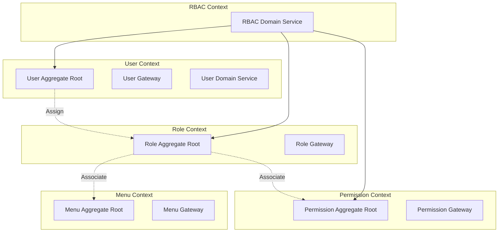
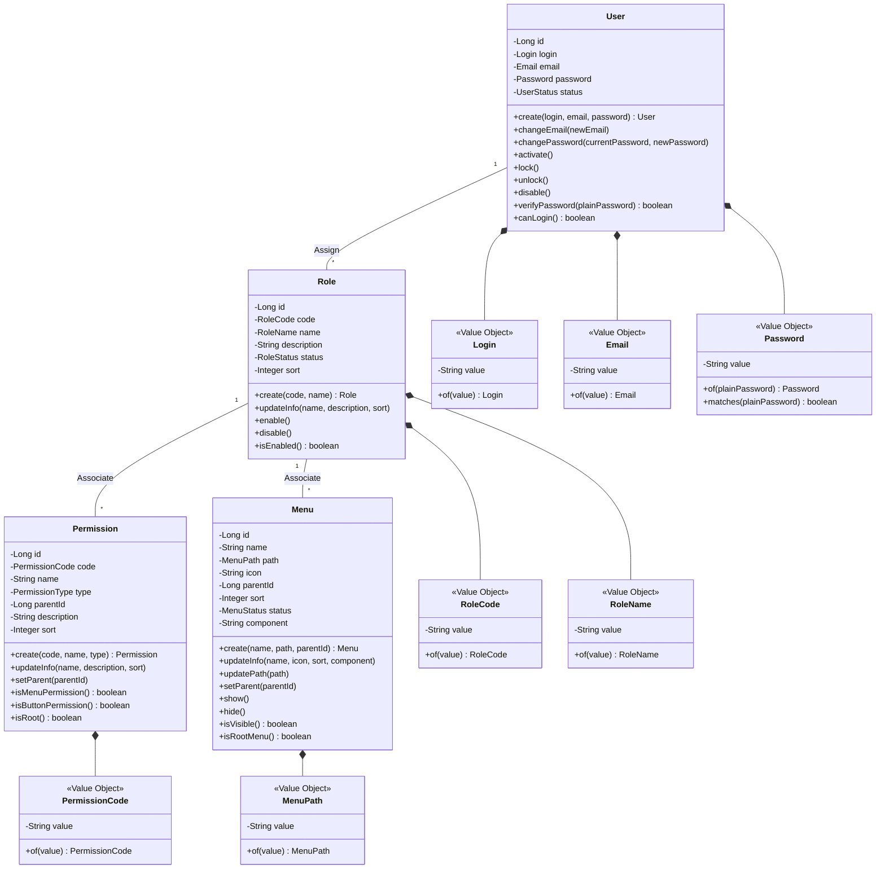
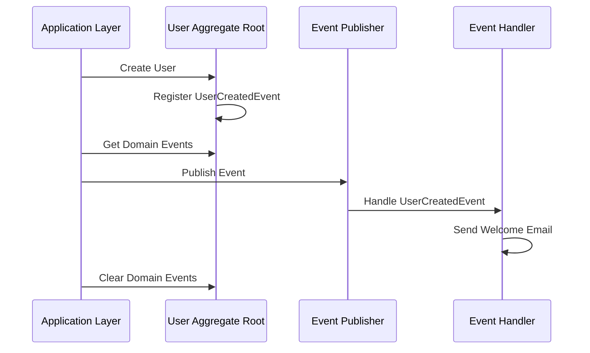
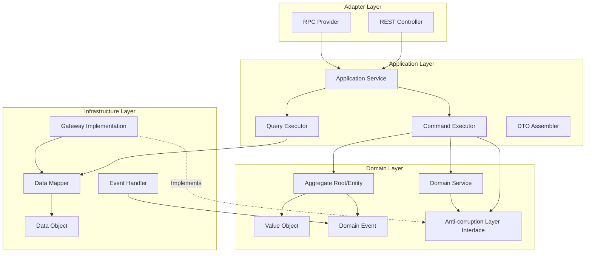
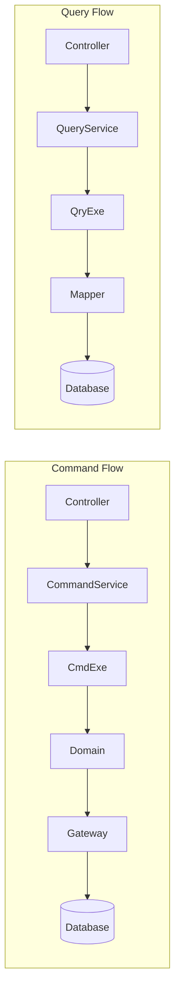

# COLA Architecture

[](https://github.com/shiyindaxiaojie/eden-demo-cola)
[](https://github.com/shiyindaxiaojie/eden-demo-cola/actions)
[](https://www.apache.org/licenses/LICENSE-2.0.html)
[](https://sonarcloud.io/dashboard?id=shiyindaxiaojie_eden-demo-cola)

<p>
  <strong>Clean, Object-oriented, Layered, Adaptable Application Architecture</strong>
</p>

English | [简体中文](./README-zh-CN.md)

---

This project is built using the COLA architecture. COLA is a clean, object-oriented, layered, and adaptable application architecture that helps reduce system entropy in complex application scenarios and improves development and operational efficiency. Whether it's traditional layered architecture, hexagonal architecture, or onion architecture, they all advocate for business-centric design, decoupling external dependencies, and separating business complexity from technical complexity. COLA architecture integrates CQRS, DDD, SOLID and other design principles on this foundation, forming a practical and implementable application architecture.

> For reference documentation, please check the [WIKI](https://github.com/shiyindaxiaojie/eden-demo-cola/wiki).

## Component Structure



* **eden-demo-cola-adapter**: Adapter layer, the inbound adapter in **Hexagonal Architecture**.
* **eden-demo-cola-app**: Application layer, responsible for **CQRS** command processing, update commands call the domain layer, query operations bypass the domain layer and directly call the infrastructure layer.
* **eden-demo-cola-client**: API layer, provides interfaces externally as a jar package.
* **eden-demo-cola-domain**: Domain layer, core business implementation. Unlike traditional layered architecture, it provides anti-corruption layer interfaces and does not depend on infrastructure layer technical implementations.
* **eden-demo-cola-infrastructure**: Infrastructure layer, the outbound adapter in **Hexagonal Architecture**, encapsulates technical details, uses **Dependency Inversion** to implement the anti-corruption layer interfaces exposed by Domain.
* **eden-demo-cola-start**: Application bootstrap entry, unified management of application configuration and delivery.


## Runtime Flow



## How to Build

Due to significant architectural changes between `Spring Boot 2.4.x` and `Spring Boot 3.0.x`, we maintain branches aligned with Spring Boot versions:

* 2.4.x branch for `Spring Boot 2.4.x`, minimum JDK 1.8.
* 2.7.x branch for `Spring Boot 2.7.x`, minimum JDK 11.
* 3.0.x branch for `Spring Boot 3.0.x`, minimum JDK 17.

This project uses Maven for building. The quickest way to get started is to `git clone` to your local machine. To simplify unnecessary technical details, this project depends on [eden-architect](https://github.com/shiyindaxiaojie/eden-architect). Execute `mvn install -T 4C` in the project root directory to complete the build.

## How to Run

### Quick Start

This project is configured with a dev environment by default. For your convenience, all external component dependencies are disabled.

1. Run `mvn install` in the project directory (add `-DskipTests` parameter to skip tests).
2. Navigate to `eden-demo-cola-start` directory, execute `mvn spring-boot:run` or start the `ColaApplication` class. If successful, you'll see the Spring Boot startup screen.
3. A simple `RestController` interface is implemented in this application. Click [Demo API](http://localhost:8081/api/users/1) to test.
4. Since frontend-backend separation is the mainstream approach, please implement pages as needed. Accessing [http://localhost:8081](http://localhost:8081) will redirect to a 404 page.


### Configuration Tuning

**Enable Service Registry and Configuration Management**: We recommend using `Nacos`. You can refer to [Nacos Quick Start](https://nacos.io/en-us/docs/quick-start.html) for quick setup. Modify the configuration file according to your Nacos address: [bootstrap-dev.yml](https://github.com/shiyindaxiaojie/eden-demo-cola/blob/main/eden-demo-cola-start/src/main/resources/config/bootstrap-dev.yml):

```yaml
spring:
  cloud:
    nacos:
      discovery: # Service Registry
        enabled: true # Disabled by default, enable as needed
      config: # Configuration Center
        enabled: true # Disabled by default, enable as needed
```

**Modify Default Data Source**: This project uses `H2` in-memory database by default, with `Liquibase` automatically initializing SQL scripts at startup. If you're using an external MySQL database, adjust the connection information here: [application-dev.yml](https://github.com/shiyindaxiaojie/eden-demo-cola/blob/main/eden-demo-cola-start/src/main/resources/config/application-dev.yml), and remove any `H2` related configurations.

```yaml
spring:
#  h2: # In-memory database
#    console:
#      enabled: true # Do not enable in production
#      path: /h2-console
#      settings:
#        trace: false
#        web-allow-others: false
  datasource: # Data source management
    username: 
    password: 
    url: jdbc:mysql://host:port/schema?rewriteBatchedStatements=true&useSSL=false&useOldAliasMetadataBehavior=true&useUnicode=true&serverTimezone=GMT%2B8
    driver-class-name: com.mysql.cj.jdbc.Driver
```

Additionally, this project includes usage examples for common components like `Redis` cache, `RocketMQ` message queue, and `ShardingSphere` database sharding, all disabled by default via `xxx.enabled`. You can enable configurations as needed to complete component integration.


## How to Deploy

### FatJar Simple Deployment

Execute `mvn -T 4C clean package` to package into a runnable fat jar, then start with the following command:

```bash
java -Dserver.port=8081 -jar target/eden-demo-cola-start.jar
```

### Assembly Package Deployment

Execute `mvn -P assembly -T 4C clean package` to create compressed packages. Copy one of the following to your desired deployment directory:

* target/eden-demo-cola-start-assembly.zip
* target/eden-demo-cola-start-assembly.tar.gz

After extraction, you can find `startup.sh` or `startup.bat` scripts in the `bin` directory. Simply run them to start.

### Jib Image Deployment

Google Jib plugin allows you to build images without installing Docker.

```bash
mvn -T 4C -U package
mvn -pl eden-demo-cola-start jib:build -Djib.disableUpdateChecks=true -DskipTests
```

### Docker Container Deployment

Build images based on Spring Boot's layered feature. Ensure Docker is properly installed, then execute:

```bash
docker build -f docker/Dockerfile -t eden-demo-cola:{tag} .
```

### Helm Application Deployment

For application-centric deployment, we recommend using Helm to manage K8s resource descriptors. Use the following commands for installation and uninstallation:

```bash
helm install eden-demo-cola ./helm # Deploy resources
helm uninstall eden-demo-cola # Uninstall resources
```

## Continuous Integration

> CI/CD Tool Options: Jenkins, CODING, Codeup, Zadig, KubeVela

### Jenkins CI

The following demonstrates continuous build and deployment using Jenkins.


### CODING CI

The following demonstrates continuous build and deployment using CODING. [Portal](https://mengxiangge.netlify.app/2022/08/10/devops/coding%20%E6%8C%81%E7%BB%AD%E9%83%A8%E7%BD%B2%E5%AE%9E%E8%B7%B5/?highlight=coding)


## Best Practices

### DDD Domain-Driven Design

This project uses RBAC (Role-Based Access Control) as an example to demonstrate how to implement DDD in COLA architecture.

#### Strategic Design

**Bounded Context Division**



#### Tactical Design

**Domain Model**



**Domain Events**




#### Layered Architecture

**COLA Layers and DDD Mapping**



**CQRS Command Query Separation**




#### Code Structure

```
eden-demo-cola-domain/
├── user/                          # User Bounded Context
│   ├── entity/                    # Entities
│   │   ├── User.java              # User Aggregate Root
│   │   └── UserStatus.java        # User Status Enum
│   ├── valueobject/               # Value Objects
│   │   ├── Login.java             # Login Account
│   │   ├── Email.java             # Email
│   │   └── Password.java          # Password
│   ├── event/                     # Domain Events
│   │   ├── UserCreatedEvent.java  # User Created Event
│   │   └── UserEmailChangedEvent.java
│   ├── domainservice/             # Domain Services
│   │   └── UserDomainService.java
│   ├── gateway/                   # Anti-corruption Layer Interfaces
│   │   └── UserGateway.java
│   └── statemachine/              # State Machine
│       └── UserStateMachine.java
├── role/                          # Role Bounded Context
│   ├── entity/
│   │   ├── Role.java              # Role Aggregate Root
│   │   └── RoleStatus.java
│   ├── valueobject/
│   │   ├── RoleCode.java
│   │   └── RoleName.java
│   └── gateway/
│       └── RoleGateway.java
├── permission/                    # Permission Bounded Context
│   ├── entity/
│   │   ├── Permission.java        # Permission Aggregate Root
│   │   └── PermissionType.java
│   ├── valueobject/
│   │   └── PermissionCode.java
│   └── gateway/
│       └── PermissionGateway.java
├── menu/                          # Menu Bounded Context
│   ├── entity/
│   │   ├── Menu.java              # Menu Aggregate Root
│   │   └── MenuStatus.java
│   ├── valueobject/
│   │   └── MenuPath.java
│   └── gateway/
│       └── MenuGateway.java
└── rbac/                          # RBAC Cross-context Coordination
    └── domainservice/
        └── RbacDomainService.java
```


#### Design Principles

| Principle | Description | Example |
|-----------|-------------|---------|
| Aggregate Root | Entry point of an aggregate, ensures consistency within the aggregate | User, Role, Permission, Menu |
| Value Object | No unique identifier, equality determined by attribute values | Login, Email, Password, RoleCode |
| Domain Event | Records important events that occur in the domain | UserCreatedEvent, UserEmailChangedEvent |
| Domain Service | Handles business logic across aggregates | UserDomainService, RbacDomainService |
| Anti-corruption Layer | Isolates domain layer from infrastructure layer | UserGateway, RoleGateway |
| Dependency Inversion | Domain layer defines interfaces, infrastructure layer implements | Gateway interface and GatewayImpl implementation |

### Git Multi-person Collaboration Branch Management

In the era of agile development, `GitFlow` seems inadequate. We've developed a simple and easy-to-use workflow for the team. [Portal](https://www.processon.com/view/63d5d1fc56e18032d4a00998)


### CAT Observability Solution

Analyze the entire trace including `HTTP` request latency, `RPC` call details, `Log` business logs, `SQL` and `Cache` execution time through `TraceId`. [Portal](https://github.com/shiyindaxiaojie/cat)


### Sentinel Traffic Governance Solution

Configure flow control rules based on business load, and view interface QPS and rate limiting status at any time. [Portal](https://github.com/shiyindaxiaojie/Sentinel)


### Arthas Online Diagnostic Tool

Use runtime probes for dynamic service discovery, out-of-the-box, allowing you to diagnose your application in low-load environments. [Portal](https://github.com/shiyindaxiaojie/arthas)


## Versioning

The project version number follows the `x.y.z` format, where x is a numeric value starting from 0 and not limited to the 0-9 range. During the incubation phase, the first digit is fixed at 0, i.e., version numbers follow the `0.x.x` format.

* Incubation version: 0.0.1-SNAPSHOT
* Development version: 1.0.0-SNAPSHOT
* Release version: 1.0.0

Version iteration rules:

* 1.0.0 <> 1.0.1: Compatible
* 1.0.0 <> 1.1.0: Mostly compatible
* 1.0.0 <> 2.0.0: Incompatible

## Changelog

Please refer to [CHANGELOG.md](https://github.com/shiyindaxiaojie/eden-demo-cola/blob/main/CHANGELOG.md)
